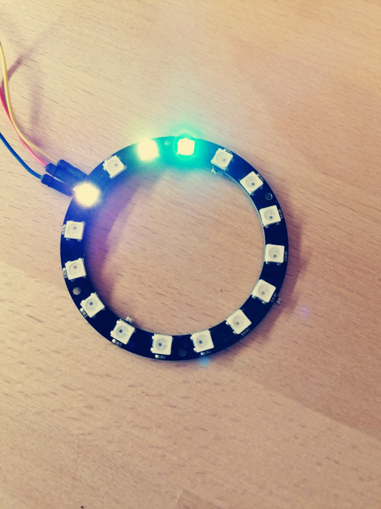

# neopixel-http

## Docker 

### Build

```
docker build -f install/python/Dockerfile -t neopixel-interface .
```

### Run 

```
docker run --rm -it --name neopixel-interface --privileged -p 80:80 neopixel-interface
```

### HTTP API 

#### Set pixels to color with opacity

```POST to http://localhost:80```

```
{
	"opacity": 0.3,
	"pixels": [
		{
			"index": 0,
			"r": 255,
			"g": 0,
			"b": 255
		},
		{
			"index": 2,
			"r": 255,
			"g": 255,
			"b": 0
		},
		{
			"index": 3,
			"r": 0,
			"g": 255,
			"b": 255
		}
	]
}
```



#### Clear all pixels


```POST to http://localhost:80/clear with empty BODY ``` 